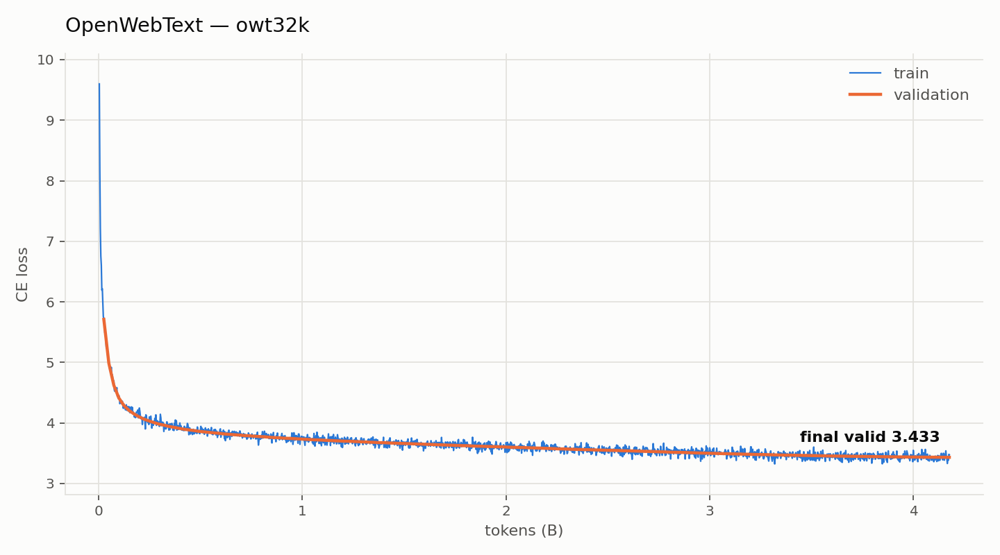

# CS336 Spring 2025 Assignment 1: Basics

A transformer language model implemented from scratch in PyTorch, following the [CS336 Spring 2025 Assignment 1: Basics](https://stanford-cs336.github.io/spring2025/assignments/assignment1_basics.html).


Loss curve for a 92.3M parameter model trained on a subsample of OpenWebText on a single RTX 4090:



## Setup

### Environment
We manage our environments with `uv` to ensure reproducibility, portability, and ease of use.
Install `uv` [here](https://github.com/astral-sh/uv) (recommended), or run `pip install uv`/`brew install uv`.
We recommend reading a bit about managing projects in `uv` [here](https://docs.astral.sh/uv/guides/projects/#managing-dependencies) (you will not regret it!).

You can now run any code in the repo using
```sh
uv run <python_file_path>
```
and the environment will be automatically solved and activated when necessary.

### Run unit tests (from original assignment repo)

```sh
uv run pytest
```

### Download data
Download a subsample of OpenWebText

``` sh
mkdir -p data
cd data

wget https://huggingface.co/datasets/stanford-cs336/owt-sample/resolve/main/owt_train.txt.gz
gunzip owt_train.txt.gz
wget https://huggingface.co/datasets/stanford-cs336/owt-sample/resolve/main/owt_valid.txt.gz
gunzip owt_valid.txt.gz

cd ..
```

### Train tokenizer on OWT

Trains a BPE tokenizer and encodes both splits into `uint16` `.npy`
token arrays:

```sh
uv run python scripts/prepare_data.py --name owt32k \
    --train data/owt_train.txt --valid data/owt_valid.txt \
    --vocab-size 32000
```


### Train the model

Example script for training a model on the OWT dataset:
```sh
uv run python -m cs336_basics.train \
    --train data/owt32k_train.npy --valid data/owt32k_valid.npy \
    --vocab-size 32000 --context-length 256 \
    --d-model 704 --num-layers 8 --num-heads 11 --d-ff 1856 \
    --batch-size 96 --max-steps 170000 \
    --lr 3e-4 --min-lr 3e-5 --warmup-steps 2000 \
    --dtype bfloat16 --compile \
    --out checkpoints/owt32k
```

Example scripts for sampling from the model:
```sh
uv run python scripts/sample.py \
    --checkpoint checkpoints/owt32k/best.pt --tokenizer tokenizers/owt32k \
    --prompt "The future of humanity is" --max-new-tokens 512
```
